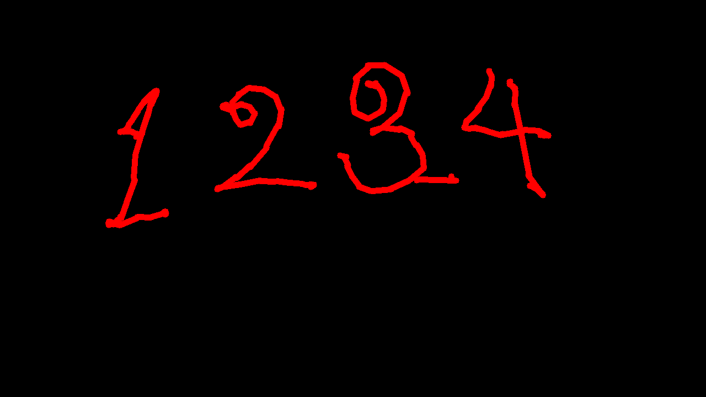

# SmartGesture# ☝ Fuzzu ML — Hand Gesture Control

A real-time hand gesture control system built with **MediaPipe**, **OpenCV**, and **PyAutoGUI**. Control your mouse cursor and draw on a virtual canvas — all with just your hand in front of a webcam.



---

## Features

### 🖱 Gesture Mouse Mode
Control your entire computer with hand gestures:

| Gesture | Action |
|---|---|
| Move index finger | Move cursor |
| Pinch thumb + index | Left click |
| Pinch thumb + middle | Right click |
| Index + middle fingers up, others curled | Scroll (up/down) |
| Make a fist | Click and drag |

### ✏ Drawing Board Mode
Draw on a virtual canvas overlaid on your webcam feed:

| Gesture | Action |
|---|---|
| Index finger only | Draw |
| Index finger near palette | Select color |
| Index finger near right edge | Adjust brush size |
| All 5 fingers open | Clear canvas |
| Press `S` | Save drawing as PNG |
| Press `Q` | Quit |

---

## Project Structure

```
Smart Gesture/
├── interface.py          # Launcher GUI (start here)
├── main.py               # Gesture mouse mode
├── drawing_board.py      # Drawing board mode
├── cursor_controller.py  # Cursor movement, clicks, scroll, drag logic
└── venv/                 # Python virtual environment
```

---

## Requirements

- Python 3.8+
- Webcam

### Python Dependencies

```
opencv-python
mediapipe
pyautogui
numpy
```

---

## Installation

**1. Clone or download the project**

```bash
git clone https://github.com/your-username/smart-gesture.git
cd "Smart Gesture"
```

**2. Create and activate a virtual environment**

```powershell
# Windows (PowerShell)
python -m venv venv
Set-ExecutionPolicy -Scope Process -ExecutionPolicy RemoteSigned
.\venv\Scripts\Activate.ps1
```

```bash
# macOS / Linux
python3 -m venv venv
source venv/bin/activate
```

**3. Install dependencies**

```bash
pip install opencv-python mediapipe pyautogui numpy
```

---

## Running the App

```powershell
# Windows (PowerShell) — activate venv first
(Set-ExecutionPolicy -Scope Process -ExecutionPolicy RemoteSigned) ; (& ".\venv\Scripts\Activate.ps1")
python interface.py
```

```bash
# macOS / Linux
source venv/bin/activate
python interface.py
```

This opens the launcher. Choose **Gesture Mouse Mode** or **Drawing Board Mode**.

---

## Configuration

Fine-tune behaviour by editing the constants at the top of `cursor_controller.py`:

| Constant | Default | Description |
|---|---|---|
| `CAM_MARGIN` | `0.15` | Edge margin — reduces how far you need to reach |
| `SMOOTH_BUFFER` | `6` | Smoothing window — higher = smoother but more lag |
| `DEAD_ZONE` | `4` | Minimum pixel movement before cursor updates |
| `PINCH_THRESHOLD` | `0.05` | Normalised pinch distance to trigger a click |
| `CLICK_COOLDOWN` | `0.4` | Seconds between repeated clicks |
| `SCROLL_ACCEL_MIN/MAX` | `20 / 120` | Scroll speed range |

---

## Tips

- **Lighting matters** — make sure your hand is well-lit and the background is not too cluttered.
- **Camera distance** — keep your hand roughly 30–60 cm from the webcam for best tracking.
- **Steady hand** — the dead zone and smoothing filter help, but slower deliberate movements are more accurate.
- Move your mouse to any screen corner to trigger the **PyAutoGUI failsafe** and stop the program immediately (only applies if you re-enable `FAILSAFE` in `cursor_controller.py`).

---

## How It Works

1. **MediaPipe Hands** detects 21 hand landmarks per frame in real time.
2. **`cursor_controller.py`** maps the index fingertip's normalised coordinates to screen pixels, applies rolling-average smoothing and a dead-zone filter, then calls PyAutoGUI to move/click/scroll.
3. Gestures are identified by comparing fingertip Y positions against PIP joint positions (tip above knuckle = finger extended).
4. **Drawing board** keeps a separate `numpy` canvas and composites it onto the live webcam frame each tick.

---

## License

MIT — free to use, modify, and distribute.

---

*Fuzzu ML · v1.0*